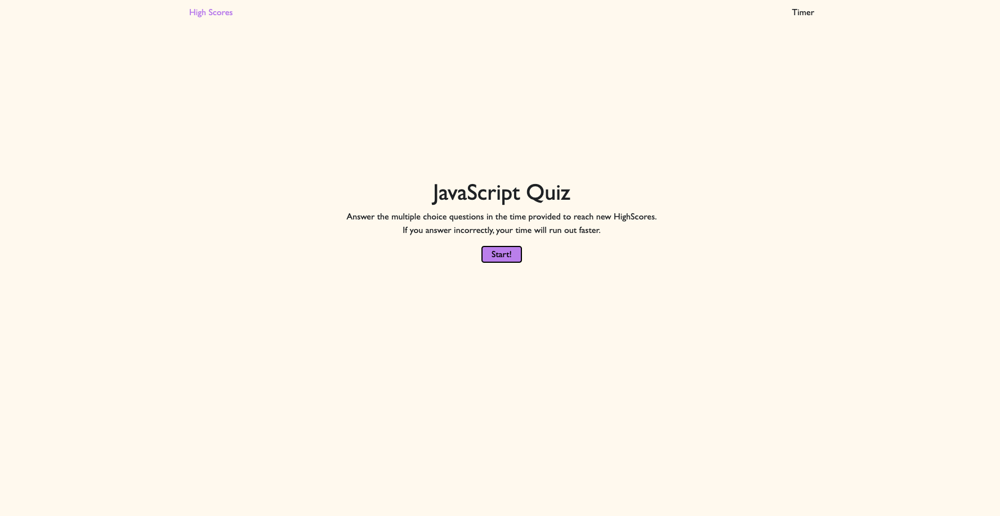
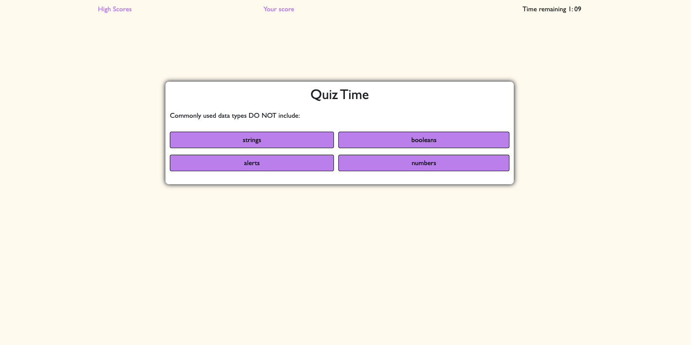
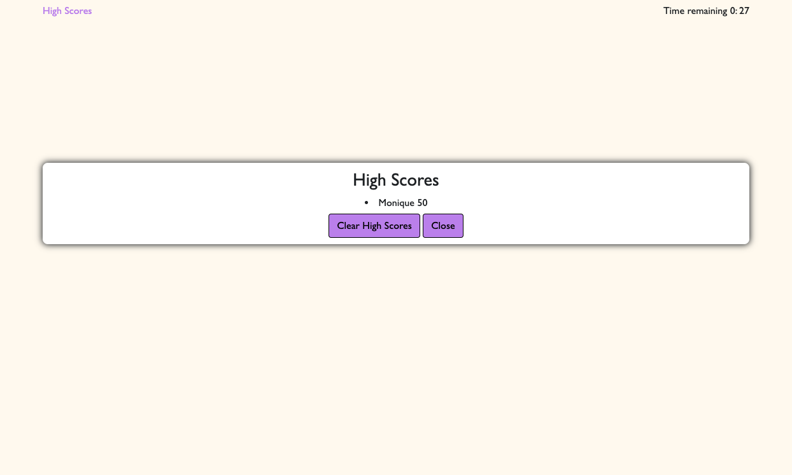

# JavaScript Quiz

## Description
Test your knowledge with some JavaScript questions, if the answer is correct, you can move onto the next question. If the answer is incorrect, watch your time reduce. 

Refresh your browser and see the high scores saved, or clear the high scores to start fresh. 
If you run out of time, the quiz will end. If you want to restart, refresh your browser. 

## Snippets

 
 

 
 

 
 

 
 

## Deployed URL
https://mloibner.github.io/JS-Quiz/index.html

### License

MIT License
Copyright (c) [2020] [Monique Loibner]

Permission is hereby granted, free of charge, to any person obtaining a copy of this software and associated documentation files (the "Software"), to deal in the Software without restriction, including without limitation the rights to use, copy, modify, merge, publish, distribute, sublicense, and/or sell copies of the Software, and to permit persons to whom the Software is furnished to do so, subject to the following conditions:

The above copyright notice and this permission notice shall be included in all copies or substantial portions of the Software.

THE SOFTWARE IS PROVIDED "AS IS", WITHOUT WARRANTY OF ANY KIND, EXPRESS OR IMPLIED, INCLUDING BUT NOT LIMITED TO THE WARRANTIES OF MERCHANTABILITY, FITNESS FOR A PARTICULAR PURPOSE AND NONINFRINGEMENT. IN NO EVENT SHALL THE AUTHORS OR COPYRIGHT HOLDERS BE LIABLE FOR ANY CLAIM, DAMAGES OR OTHER LIABILITY, WHETHER IN AN ACTION OF CONTRACT, TORT OR OTHERWISE, ARISING FROM, OUT OF OR IN CONNECTION WITH THE SOFTWARE OR THE USE OR OTHER DEALINGS IN THE SOFTWARE.
