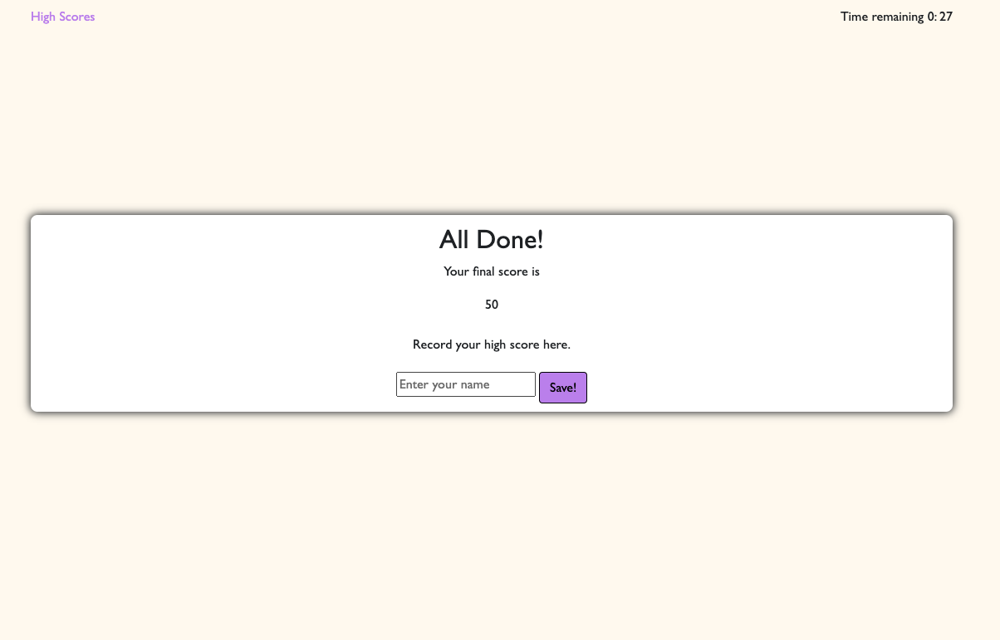

# JavaScript Quiz

## Description
Test your knowledge with some JavaScript questions, if the answer is correct, you can move onto the next question. If the answer is incorrect, watch your time reduce. 

Refresh your browser and see the high scores saved, or clear the high scores to start fresh. 
If you run out of time, the quiz will end. If you want to restart, refresh your browser. 

## Snippets

 
 

 
 

 
 

 
 

## Find the Quiz here:
https://mloibner.github.io/JS-Quiz/index.html
